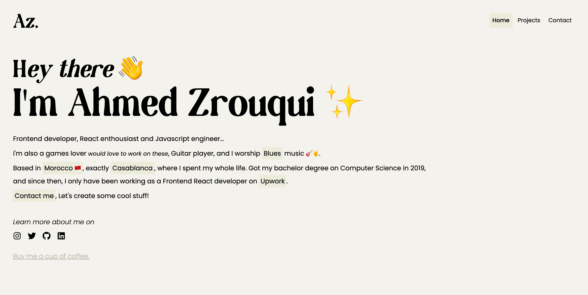

# Personal Portfolio

Hey there, Happy to share my personal portfolio project with you, the project is free to use.

live preview at : https://ahmedzrouqui.com

## Before running the project, set EmailJS variables :

before you run the project, you should create a new account on [EmailJs](https://emailjs.com).

After creating the account, go to the root and create a `.env` and declare these variables :

`REACT_APP_EMAIL_USER_ID`,
`REACT_APP_EMAIL_TEMPLATE_ID`,
`REACT_APP_EMAIL_SERVICE_ID`,

You can find these values in your [EmailJs](https://emailjs.com) Dashboard.

## Available commands:

in the root folder, you can run :

`yarn` to install the dependencies.

`yarn start` to start the server, will redirect you to [localhost:3000](localhost:3000).

`yarn build` to build and deploy your website.
